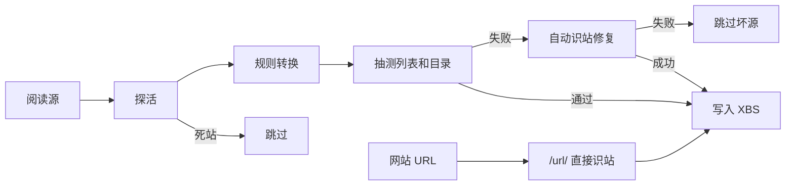

# read2xsgg

[](https://github.com/baixiaoshengofficial/read2xsgg/actions/workflows/test.yml)
[](https://hub.docker.com/r/knighttools/read2xsgg)

把「阅读 / Legado 3.x」的 JSON 书源转换成「香色闺阁」可导入的 `.xbs` 源，同时生成一份可审阅的香色 JSON 和兼容性报告。

## 功能

- 支持单个书源、书源数组，以及常见的 `sources` / `bookSources` 包装格式。
- 按阅读 `bookSourceType` 映射香色 `sourceType`：`0→text`、`1→audio`、`2→comic`、`4→video`；对历史源中误标为 `0` / `3` 的类型，会结合分组和正文能力推断小说、漫画、音频或视频，真正的文件下载源仍按 text 输出并告警。
- 转换搜索、详情、目录、正文和发现页规则；漫画正文由通用图片桥接提取，音频和视频正文由通用媒体桥接输出香色播放用的 `{url, httpHeaders, forbidCache}` JSON。
- 生成的选择器后处理统一使用香色 2.56.1 实测可执行的 `selector||@js:` 语法，不再输出会被当成普通选择器的单竖线 `selector|@js:`。
- 转换 XPath、JSONPath、阅读的 Jsoup 链式选择器、常见 CSS，以及 `{{@sel}}` / `{{Get('url')}}` 一类 Mustache 模板（登录分流回退为 `config.host`）。
- 转换 GET、POST、请求头、表单参数、关键字/页码模板和 GBK 编码配置。
- 原生生成 XXTEA 加密的 `.xbs`，不依赖外部转换程序。
- 对无法无损翻译的阅读 JS、`imageDecode`、登录 UI、递归 JSONPath、详情 `init` 等规则生成结构化告警。
- 输入既可以是本地文件、URL，也可以来自标准输入。
- 提供 HTTP 在线转换服务，香色闺阁可以直接订阅转换 URL。
- 提供 WebUI 源管理：异步完整抽测后生成稳定的 `/library/{id}.xbs` 订阅地址。
- 提供受 SSRF 防护的图片代理与可扩展解码器：普通图片直通，已内置猕猴桃漫画的 AES-CBC 图片解码。
- 为没有可移植发现页的源自动补充“站点首页”或“搜索入口”分类，避免源已导入但无法在香色的切换站点列表中选中。
- 提供 Docker Compose 一键部署、健康检查、缓存、并发控制和 SSRF 防护。

## 环境

需要 Node.js 18 或更高版本，无第三方运行时依赖。

```bash
npm test
npm link
```

也可以不安装，直接用 `node ./bin/read2xsgg.js`。

## Docker Compose 一键部署

先准备口令（可选但 WebUI 需要）：

```bash
cp .env.example .env
# 编辑 .env 中的 ADMIN_TOKEN
```

直接使用 Docker Hub 镜像：

```bash
docker compose pull
docker compose up -d
```

镜像地址：`knighttools/read2xsgg:latest`。

如果希望从当前源码重新构建：

```bash
docker build -t knighttools/read2xsgg:local .
IMAGE_TAG=local docker compose up -d --pull never
```

默认监听 `http://localhost:3000`，检查服务状态：

```bash
curl http://localhost:3000/healthz
docker compose ps
```

停止服务：

```bash
docker compose down
```

修改宿主机端口：

```bash
APP_PORT=8080 docker compose up -d
```

指定版本镜像：

```bash
IMAGE_TAG=0.2.0 docker compose up -d
```

## 本地发布到 Docker Hub

不再通过 GitHub Actions 推镜像（无需配置 `DOCKERHUB_TOKEN` secret）。本机登录 Docker Hub 后执行：

```bash
docker login
./scripts/docker-push.sh
```

默认推送：

- `knighttools/read2xsgg:latest`
- `knighttools/read2xsgg:sha-<commit>`
- 两个标签都包含 `linux/amd64` 和 `linux/arm64` 镜像清单

可覆盖镜像名 / 标签 / 平台：

```bash
IMAGE=knighttools/read2xsgg TAG=0.2.0 PLATFORM=linux/amd64 ./scripts/docker-push.sh
```

服务器部署时直接拉取：

```bash
docker compose pull
docker compose up -d
```

## 在线订阅（两种用法）

香色闺阁会检查链接是否以 `.xbs` 结尾。本站支持同步直转，也支持 WebUI 异步完整抽测后再订阅。

### 0. WebUI 异步源管理（推荐大聚合源）

大合集（几十上百个源）同步 `/source/` 会受抽测预算限制；WebUI 在后台做**完整抽测 + 识站回退**（默认不设时间上限），并实时显示进度与当前站点；完成后给出稳定订阅地址。

上千源的超大组合包可以完整抽测，耗时可能很长；可用 `JOB_VERIFY_BUDGET_MS`（毫秒，`0` 表示不限）在需要时加墙钟上限。

1. 复制环境变量并填写管理口令：

```bash
cp .env.example .env
# 编辑 .env：ADMIN_TOKEN=你的口令
docker compose up -d
```

`.env` 不会提交到 Git；Compose 会自动读取其中的 `ADMIN_TOKEN`。

2. 打开 `{本站}/ui/`，用同一口令登录后进入源管理，粘贴阅读源 JSON URL（或选「网站识站」）。
3. 等待任务变为 `done`，复制公开订阅地址：

```text
{本站}/library/{id}.xbs
```

管理 API（需 `Authorization: Bearer $ADMIN_TOKEN` 或 `X-Admin-Token`）：

- `POST /api/jobs` — `{ "url", "mode": "source"|"site", "name?" }`
- `GET /api/jobs` / `GET /api/jobs/:id`
- `POST /api/jobs/:id/retry`
- `DELETE /api/jobs/:id`

制品落在 `DATA_DIR`（Compose 默认 volume `read2xsgg-data` → `/data`）。未设置 `ADMIN_TOKEN` 时管理接口返回 503。

同步路径仍然可用；大聚合建议优先走 WebUI。

### 1. 网站识站 `/url/`

直接给小说站首页，自动探测列表/目录/正文并生成香色源：

```text
{转换站}/url/{去掉 https:// 后的网站主机}.xbs
```

例如网站是 `https://www.novel-site.example/`：

```text
https://xs.chenqinfeng.de/url/www.novel-site.example.xbs
```

### 2. 阅读源转换 `/source/`（同步直转）

给阅读（Legado）书源 JSON 地址，探活 → 转换 → 有限抽测（大源可能跳过/截断抽测预算）。适合少量源；**大聚合请用 WebUI**。

同步转换结果也会写入 `DATA_DIR/conversions`，因此服务或容器重启后可直接复用；有效期沿用 `CACHE_TTL_SECONDS`（默认 300 秒）。需要长期稳定且可管理的订阅请使用 WebUI 生成的 `/library/{id}.xbs`。

```text
{转换站}/source/{去掉 https:// 后的阅读源地址}.xbs
```

例如阅读源是：

```text
https://www.yckceo.com/yuedu/shuyuans/json/id/1193.json
```

对应订阅地址：

```text
https://xs.chenqinfeng.de/source/www.yckceo.com/yuedu/shuyuans/json/id/1193.json.xbs
```

单个书源示例（爱丽丝书屋）：

```text
https://xs.chenqinfeng.de/source/www.yckceo.com/yuedu/shuyuan/json/id/7585.json.xbs
```

兼容别名（旧订阅可继续用）：`/xbs/...`、`/x.xbs?u=...`、`/convert.xbs?url=...`、`/analyze.xbs?url=...`。

查看转换后的 JSON 和兼容性告警：

```text
http://localhost:3000/j/www.example.com/legado.json
http://localhost:3000/convert/json?url=https://example.com/legado.json
```

可以直接运行 HTTP 服务而不使用 Docker：

```bash
npm start
# 或
node ./bin/server.js
```

### 漫画图片解码代理

香色不能执行阅读的 `java.createSymmetricCrypto` 或 Android 图像 API。服务提供图片代理，把解码放在 Node.js 侧：

```text
{转换站}/image?url=https://cdn.example.com/image.jpg
{转换站}/image/mwwz-aes?url=https://cdn.example.com/encrypted-image
{转换站}/image/jm-scramble?url=https://cdn.example.com/photos/230000/1.jpg
```

`/image` 会直通 JPEG、PNG、GIF、WebP 等常见图片，并尝试已注册的解码能力。在线转换不会按站点域名选择解码器，而是分析阅读源 `imageDecode` 中的算法：AES-CBC 前缀 IV 会自动提取 16/24/32 字节密钥；MD5 分块倒序会自动提取取模数和偏移量；书号/图片号分块会按规则形态启用对应能力。旧的 `/image/mwwz-aes`、`/image/jm-scramble` 地址仅作为兼容别名保留。代理只会返回验证过图片文件头的结果，且与在线转换一样禁止访问内网地址。

在线转换时，所有漫画正文都会使用规则驱动的通用桥接。转换器先把阅读 `ruleContent.content` 编译成一个不含可执行代码的提取计划，自动识别 JSON/JavaScript 属性（如 `imageUrl`、`pageSrc`、`url`）和 HTML 属性（如 `src`、`data-original`、`data-src`）；服务端再按该计划解析 HTML、JSON API、Next/React 分片脚本、`img/source` 标签或纯 URL 列表，最后返回香色原生的 `{urls:[...]}`。对于带 `page` / `pageIndex` 等查询参数的 JSON 漫画接口，还会自动识别 `current_page`、`total_pages`、`total`、`page_size` 及其驼峰别名，并发拉取、按页序去重合并全部图片。没有明确字段提示时，会自动发现包含图片 URL 的属性组并选择最可信的连续序列。原阅读源的 User-Agent、Referer、Cookie 等请求头会经过清理后随安全提取计划传给正文上游；Host、Content-Length 和连接级请求头不会透传。整个过程不使用站点域名作为判断条件，也不会执行阅读源携带的任意 JavaScript。

提取图片序列后，编译器会继续按 `imageDecode` 的算法能力选择参数化解码器。代理地址会从本次转换 URL 自动推导：优先使用 `Forwarded` 或 `X-Forwarded-Host` / `X-Forwarded-Proto`，公网域名默认使用 HTTPS；无需配置对外基础 URL。反向代理应保留 `Host`，并传递主机和协议头。

解码器按算法能力注册，而不是按网站注册。若以后出现当前能力集之外的全新加密或像素算法，只需新增一次该算法能力；采用相同算法的其他阅读源会从规则中自动识别并复用，不需要再增加域名或站点分支。登录态、验证码以及依赖完整 Android 环境的任意 JavaScript 仍无法安全地凭空执行。

### 音频与视频媒体桥接

音频和视频源与文本书源一样走完整核心链路（搜索 → 详情 → 目录 → 正文），不会因为类型是有声/视频就被质量门槛整类丢掉。转换器从 `ruleContent` 中编译安全的字段和 HTML 属性提示；若带有阅读 `sourceRegex`，会把其中的媒体扩展名（如 `.mp3`、`.m3u8`）编入提取计划的 `urlHints`。在线服务再从 JSON、HTML、脚本片段、`audio` / `video` / `source` / `iframe` 标签中寻找媒体地址，并优先命中这些扩展名提示，同时支持 HLS（`.m3u8`）和 DASH 分片。

播放地址经通用媒体适配器解析后，直接交给香色播放，并带上源站 `httpHeaders`（Referer / Cookie）。默认不再把音频塞进 `/media` 代理：代理会把 Referer 改成 CDN 域名，容易触发防盗链。`/media?url=` 仍保留给需要服务端转发的特殊场景。

若章节 URL 本身就是媒体地址则直接播放；若接口同时返回多个清晰度，会优先选择较高质量版本。转换器不会执行阅读源携带的远程 JavaScript、`eval` 或 Android 原生 API。

### 大型混合源验证

在线转换管线现在是：**探活 → 按阅读规则转换 → 抽测列表/目录 → 失败则自动识站修复 → 仍失败则跳过（不把坏源写入 XBS）**。站点可达时，抽测/识站失败视为转换器问题：必须用识站通用解析修成可用香色源，否则丢弃。



Compose **默认同步路径**开启 origin 探活、抽测与识站修复；仅当抽测墙钟预算用尽时，未抽测的源才会暂时保留：

- `PREFLIGHT_SOURCES=true`
- `VERIFY_CONVERTED_SOURCES=true`
- `ANALYZE_FALLBACK=true`（同步 `/source` 与 WebUI 任务都会识站修复）
- `VERIFY_BUDGET_MS=20000` / `VERIFY_MAX_SOURCES=50`（仅同步 `/source`；超限跳过抽测直接保留）
- `JOB_VERIFY_BUDGET_MS=0`（WebUI 异步任务抽测墙钟预算；`0` 为完整抽测不限时）
- `PREFLIGHT_CONCURRENCY=8`（探活与抽测共用并发；同源识站结果会复用）
- `ADMIN_TOKEN`（写在 `.env`，WebUI / `/api/jobs` 必需）
- `DATA_DIR=/data`
- `CACHE_TTL_SECONDS=300`（同步转换结果的内存与磁盘缓存有效期）
- `PREFLIGHT_DEEP_SOURCES=false`（全链路深检仍为 opt-in）

直接识站（不经过阅读源）：

```bash
# HTTP（推荐手拼）
curl -OJ "https://xs.chenqinfeng.de/url/www.novel-site.example.xbs"
# 兼容查询参数
curl "https://xs.example/analyze/json?url=https://www.novel-site.example/"

# CLI
npm run convert -- --analyze https://www.novel-site.example/ -o site.xbs --json site.json
```

阅读源本地转换若要启用抽测+回退：

```bash
npm run convert -- legado.json --verify --analyze-fallback -o sources.xbs --report report.json
```

识站会对首页做多类型信号检测；**每种能发现可用列表/目录/正文结构的类型各出一条源**（命名如 `站点·小说` / `站点·漫画` / `站点·听书` / `站点·影视`）。导出前会做两道校验：

1. **结构校验**：`sourceUrl` / `sourceType` / `miniAppVersion`、分类/搜索/详情/章节/正文必填字段、禁止单竖线 `|@js:`
2. **动作链实测**：用与香色相同的选择器执行器跑通 分类列表 → 详情 → 章节 → 正文（漫画/音视频还会拉一条媒体 URL）

任一关失败则丢弃该类型，并在 JSON 的 `skippedKinds` 中说明原因。登录墙、强 JS 渲染站仍无法保证。

响应头 `X-Converted-Count` / `X-Skipped-Count` / `X-Skipped-Buckets` / `X-Fallback-Count` 便于观察：有多少是规则转换通过，有多少是识站回退。分桶包括 `dead-origin`、`core-chain`、`rules-stale`、`analyze-failed`、`imageDecode`、`login`、`media`。

本机 Docker 发布脚本默认先执行包括离线动作链在内的完整测试，测试失败不会构建或推送镜像。只有明确设置 `SKIP_VALIDATION=1` 才会跳过该门槛。

### 服务配置

Compose 支持通过环境变量调整：

| 变量 | 默认值 | 说明 |
| --- | ---: | --- |
| `APP_PORT` | `3000` | 映射到宿主机的端口 |
| `FETCH_TIMEOUT_MS` | `15000` | 下载在线阅读源的超时时间 |
| `MAX_SOURCE_BYTES` | `33554432` | 在线阅读源最大字节数（32 MiB，可容纳大型聚合源） |
| `MAX_IMAGE_BYTES` | `26214400` | 单张代理图片最大字节数 |
| `MAX_MEDIA_BYTES` | `83886080` | 单次 `/media` 代理最大字节数（约 80 MiB） |
| `MAX_REDIRECTS` | `5` | 最大重定向次数 |
| `MAX_CONCURRENT` | `8` | 最大并发转换数 |
| `CACHE_TTL_SECONDS` | `300` | 内存缓存时间，设为 `0` 可关闭 |
| `MAX_CACHE_ENTRIES` | `100` | 最大缓存条目数 |
| `CORS_ORIGIN` | `*` | 允许的跨域来源 |
| `ALLOW_PRIVATE_NETWORKS` | `false` | 是否允许抓取本机或内网 URL |
| `ALLOW_DNS_PROXY_NETWORKS` | `true` | 允许域名经 Docker Desktop、Clash 等代理解析到 `198.18.0.0/15`；直接输入该网段 IP 仍会被拦截 |
| `PREFLIGHT_SOURCES` | `true` | 转换前探测上游站点是否可达（origin）；设为 `false` 可跳过探活以加快转换，但会死站也会进入 XBS |
| `PREFLIGHT_DEEP_SOURCES` | `false` | 实测分类列表、第一本书、章节和正文；仅在 `PREFLIGHT_SOURCES=true` 时生效。聚合源成本高，默认关闭 |
| `PREFLIGHT_TIMEOUT_MS` | `3000` | 单个上游站点预检/抽测超时时间 |
| `PREFLIGHT_CONCURRENCY` | `8` | 上游站点并发预检/抽测数量；不建议在小内存容器中调高 |
| `VERIFY_CONVERTED_SOURCES` | `true` | 转换后抽测分类列表与目录是否非空；失败进入识站修复，再失败则跳过 |
| `ANALYZE_FALLBACK` | `true` | 抽测失败时用启发式识站生成可用香色源；仍失败则跳过坏源 |
| `ANALYZE_TIMEOUT_MS` | `8000` | 自动识站单次页面下载超时 |
| `MAX_COMIC_PAGES` | `50` | 单章 JSON 漫画接口最多聚合的分页数（含第一页） |
| `MAX_COMIC_IMAGES` | `2000` | 单章最多返回的图片数 |
| `COMIC_PAGE_CONCURRENCY` | `4` | 单章后续图片分页的并发请求数 |

服务默认禁止访问回环、内网、链路本地和保留地址，以降低公开部署时的 SSRF 风险。如果只在可信内网使用，并且阅读源本身位于局域网，可以这样开启：

```bash
ALLOW_PRIVATE_NETWORKS=true docker compose up -d
```

如果服务器没有使用虚拟 DNS/透明代理，并希望采用最严格的公网地址校验，可以关闭兼容开关：

```bash
ALLOW_DNS_PROXY_NETWORKS=false docker compose up -d
```

## 使用

```bash
read2xsgg legado.json \
  -o sources.xbs \
  --json sources.converted.json \
  --report sources.report.json
```

只查看转换后的 JSON：

```bash
read2xsgg legado.json --json-only > sources.json
```

从 URL 或管道读取：

```bash
read2xsgg https://example.com/legado.json -o sources.xbs
curl -s https://example.com/legado.json | read2xsgg - --json-only > sources.json
```

在代码中调用：

```js
import { convertLegado, encodeXbs } from "read2xsgg";

const { sources, warnings } = convertLegado(legadoJson);
const xbs = encodeXbs(sources);
```

## 转换范围与限制

两款应用的规则引擎并不相同，因此转换器采取“能确定语义就转换，不能确定就保留并告警”的策略。

可以自动转换的主要内容：

| 阅读 | 香色闺阁 |
| --- | --- |
| `searchUrl` | `searchBook.requestInfo` |
| `ruleSearch` | `searchBook` |
| `ruleBookInfo` | `bookDetail` |
| `ruleToc` | `chapterList` |
| `ruleContent` | `chapterContent` |
| `exploreUrl` + `ruleExplore` | `bookWorld` |
| `{{key}}` / `{{page}}` | `%@keyWord` / `%@pageIndex` |
| Jsoup/CSS/JSONPath | XPath/香色 JSON 路径 |

以下内容需要重点查看 `--report` 生成的报告：

- `@js:`、`<js>` 规则：两边的全局变量和原生 API 不同，代码会保留，但通常需要手工适配。
- `$..field` 递归 JSONPath：香色没有完全等价的递归下降表达式，会退化为普通路径。
- `ruleBookInfo.init`：香色没有直接对应字段。
- 登录、验证码、WebView 注入、加密签名等依赖阅读运行时的高级行为。
- 已下线、拒绝当前服务器访问或必须登录才能读取的上游站点；转换器不会用站点专用逻辑伪造可用结果。

建议第一次转换时始终同时生成 JSON 和报告，先在香色闺阁中导入少量源测试搜索、详情、目录、正文四个环节，再批量导入。

## XBS 兼容性

`.xbs` 的编码/解码实现与开源项目 [xbsrebuild](https://github.com/ne1llee/xbsrebuild) 的格式兼容。测试覆盖了加解密往返；项目本身不会联网提交或执行书源中的脚本。

规则字段同时经过本项目动作链验收器和独立的香色 2.56.1 HTTP 规则模拟器验证。生成器只发布 `||@js:` 后处理形式；单竖线 `|@js:` 即使能在部分资料中看到，也不会作为转换结果输出。真实 App 的 WebView、登录态和系统网络环境仍可能与 HTTP 模拟器不同，遇到这类源会在预检或兼容性报告中明确跳过/告警，而不是把它标成已验证可用。
